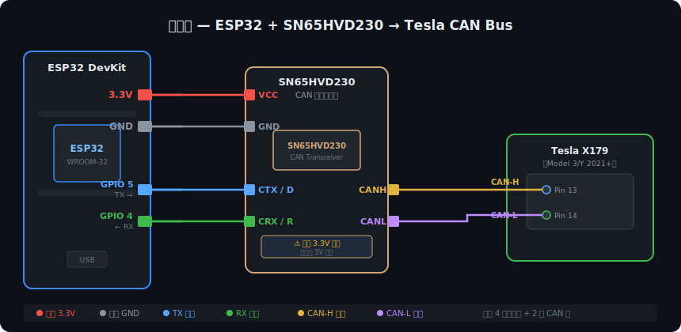
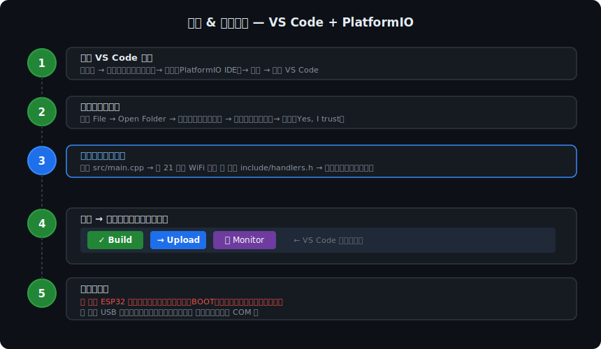

# Tesla FSD Controller — ESP32 Web 版

> ## 🚫 重要公告：本项目对中国国内车辆已失效
>
> 自 **2026 年 3 月 31 日晚 9 时左右**，Tesla 向中国国内车辆远程下发了底层配置，从芯片层面禁用了 FSD 相关功能。**CAN 总线层面的修改已无法绕过此限制，本项目对中国国内车辆不再有效。**
>
> 注意：封禁期间 **FSD 账号授权不受影响**，已购买或订阅的 FSD 资格仍然保留，仅本 mod 失效。
>
> 海外车辆暂不受影响。本项目代码保留供学习、研究及海外用户使用。

---

基于 [tesla-open-can-mod](https://gitlab.com/Tesla-OPEN-CAN-MOD/tesla-open-can-mod) 的 ESP32 + WiFi 控制面板版本。

烧录后，ESP32 会创建一个 WiFi 热点，手机连上就能用浏览器实时控制所有参数，**无需重新编程**。

---

## ⚠️ 重要声明（请先读完）

1. **仅限已购买 FSD 的车辆** — 本设备只是解锁 CAN 总线层面的限制，Tesla 服务器端必须有有效的 FSD 授权，否则不生效。
2. **风险自担** — CAN 总线直接连接车辆关键系统，发送错误报文可能导致不可预期的行为或电子部件损坏。本项目仅供学习和测试用途，作者不承担任何因使用本项目造成的车辆损坏、人身伤害或其他损失。
3. **保修失效** — 对车辆 CAN 总线进行改装可能导致 Tesla 官方保修失效，风险由使用者自行承担，作者对此不承担任何责任。
4. **遵守当地法律法规** — 在公共道路上使用辅助驾驶功能须符合你所在地区的交通法规。部分功能在特定地区可能存在法律限制，请在使用前自行了解并遵守当地相关法律，作者不对任何法律后果负责。
5. **交通事故免责** — 使用本设备期间发生的任何交通事故，包括但不限于车辆碰撞、财产损失、人身伤亡，责任由驾驶员本人承担，作者及项目贡献者不承担任何连带责任。驾驶时请始终保持专注，手握方向盘，随时准备接管车辆。
6. **不适用于公共道路测试** — 初次使用请在私有场地进行，确认功能正常后再上路。

---

## 所需材料

> 以下材料在淘宝/京东均可购买，搜索括号内的关键词即可。

| 材料 | 说明 | 参考价 |
|------|------|--------|
| ESP32 开发板 | 搜「ESP32-DevKitC」或「ESP32 38Pin 开发板」 | ¥20–35 |
| SN65HVD230 模块 | 搜「SN65HVD230 CAN 模块 3.3V」，注意买 **3.3V** 版本 | ¥5–15 |
| 杜邦线（母对母）| 搜「杜邦线 母对母 20cm」，买一包备用 | ¥5 |
| USB 数据线 | Micro-USB 或 Type-C，取决于你的 ESP32 型号，用于烧录 | 通常自备 |

> **为什么选 ESP32？** 内置 WiFi 和原生 CAN（TWAI）控制器，无需额外芯片，成本最低。

---

## 接线方法



### ESP32 ↔ SN65HVD230 模块

```
ESP32 GPIO 5  →  SN65HVD230 TX（有的板子标 CTX/D）
ESP32 GPIO 4  →  SN65HVD230 RX（有的板子标 CRX/R）
ESP32 3.3V    →  SN65HVD230 VCC
ESP32 GND     →  SN65HVD230 GND
```

### SN65HVD230 ↔ 车辆 CAN 总线

```
SN65HVD230 CANH  →  车辆 CAN-H（通常为白色/棕色线）
SN65HVD230 CANL  →  车辆 CAN-L（通常为蓝色/绿色线）
```

> 🚫 **禁止使用 OBD2 接口**：OBD2 诊断口连接的是诊断 CAN 总线，经过车辆网关 ECU 隔离，修改后的报文**永远无法到达 Autopilot 电脑**，设备将完全无效。必须直接接车辆内部 CAN 总线（X179 / X652 连接器）。
>
> ⚠️ **以下接线位置仅适用于 Model 3 / Model Y，已经过社区验证。Model S、Model X、Model 3 Highland、Model Y Juniper、Cybertruck 等其他车型的连接器位置不同，请勿照搬，必须自行查阅 Tesla 官方服务手册。**
>
> - **Model 3 / Model Y（2021 及以后）**：推荐接 X179 连接器，Pin 13（CAN-H）/ Pin 14（CAN-L）
> - **Model 3（2020 及以前旧款）**：推荐接 X652 连接器，Pin 1（CAN-H）/ Pin 2（CAN-L）
>
> 不确定时请先查阅 Tesla 服务手册，切勿盲目拆车接线。

### 接线示意图

```
[车辆 CAN-H] ─────────────┐
                           │  SN65HVD230
[车辆 CAN-L] ─────────────┤   模块
                        CANH/CANL
                           │
                        TX → GPIO5
                        RX → GPIO4   [ESP32]
                       VCC → 3.3V
                       GND → GND
                                │
                              USB
                                │
                          [电脑/充电宝]
```

---

## 第一步：安装软件



### 1.1 安装 VS Code

1. 打开 [https://code.visualstudio.com](https://code.visualstudio.com)，点击下载并安装。
2. 安装完成后打开 VS Code。

### 1.2 安装 PlatformIO 插件

1. 点击 VS Code 左侧的「扩展」图标（四个方块的图标）。
2. 搜索 `PlatformIO IDE`，点击「安装」。
3. 安装完成后，VS Code 底部状态栏会出现一个小房子图标，表示 PlatformIO 已就绪（可能需要重启 VS Code）。

> **安装很慢？** PlatformIO 第一次启动会下载 ESP32 工具链，大约 200–500 MB，请耐心等待，保持网络畅通。

---

## 第二步：下载并打开项目

1. 点击本页面右上角的绿色「Code」按钮，选择「Download ZIP」。
2. 解压到任意文件夹，例如 `D:\tesla-fsd`。
3. 打开 VS Code，点击菜单「文件 → 打开文件夹」，选择刚才解压的文件夹。
4. VS Code 右下角可能会弹出「是否信任此文件夹」，点击「是，我信任作者」。

---

## 第三步：修改配置

> 在烧录前，至少需要完成 **3.1（WiFi 密码）** 和 **3.2（选择硬件版本）** 两项配置。

### 3.1 修改 WiFi 热点名称和密码

打开文件 `src/main.cpp`，找到第 21–22 行：

```cpp
static const char* AP_SSID = "FSD-Controller";
static const char* AP_PASS = "12345678";
```

- `AP_SSID`：WiFi 热点名称，可以改成你喜欢的名字。
- `AP_PASS`：**强烈建议改成你自己的密码**（至少 8 位），防止他人连接后控制你的车辆。

**示例**（改成自己的）：

```cpp
static const char* AP_SSID = "MyTeslaFSD";
static const char* AP_PASS = "MySecret2024";
```

### 3.2 选择硬件版本

打开文件 `include/handlers.h`，找到顶部的版本定义（通常在第 1–10 行附近）：

**如何判断应该选哪个版本？**

选择依据是**固件版本（FSD V13/V14）**，不只是硬件版本：

| 车机显示 | 软件版本 | FSD 版本 | 选择 |
|----------|----------|----------|------|
| HW4.x | 2026.2.9.x 或更新 | V14 | `HW4` |
| HW4.x | 2026.8.x 或更旧 | V13 | `HW3` ⚠️ |
| HW3.x | 任意 | V13 | `HW3` |
| 旧款 Model S/X（竖屏）| 任意 | — | `LEGACY` |

> ⚠️ **HW4 硬件 + V13 固件必须选 `HW3`**：HW4 模式专为 FSD V14 设计，在 V13 固件上会导致功能不稳定（时好时坏）。在车机「控制 → 软件」中查看软件版本号来判断。

在代码中确认对应的定义已启用（只能保留一个 `#define`）：

```cpp
// 只保留你需要的那一行，其他行加 // 注释掉
#define HW4     // ← HW4 车辆
// #define HW3  // ← HW3 车辆
// #define LEGACY  // ← 旧款 Model S/X
```

---

## 第四步：烧录固件

### 连接 ESP32

用 USB 线将 ESP32 连接到电脑。

### 在 VS Code 中烧录

1. 点击 VS Code 底部状态栏左侧的「✓ Build」按钮先编译，确认没有错误。
2. 编译成功后，点击旁边的「→ Upload」按钮开始烧录。
3. 烧录成功后，终端会显示 `success`。

> **遇到「上传失败」？**
> - 检查 USB 线是否支持数据传输（有些线只能充电）。
> - 在 VS Code 底部状态栏点「端口」，确认已正确识别 ESP32 的 COM 口。
> - 部分 ESP32 开发板需要在上传时**按住 BOOT 按钮**，直到出现上传进度条后松开。

---

## 第五步：使用控制面板

### 5.1 连接 WiFi

1. 将 ESP32 上电（可以用充电宝供电，也可以直接从 USB 供电）。
2. 用手机打开 WiFi 设置，找到 `FSD-Controller`（或你修改的名字），输入密码连接。
3. 连接后，手机浏览器访问 `192.168.4.1`。

### 5.2 控制面板说明

| 设置项 | 说明 |
|--------|------|
| **FSD 开关** | 总开关，关闭后设备不修改任何 CAN 报文 |
| **硬件版本** | 对应你的车辆硬件，与第 3.2 步一致（可运行时切换，无需重新烧录）|
| **速度模式** | 控制 FSD 行驶激进程度，见下方速度模式说明 |
| **模式来源** | 「自动（拨杆）」= 用跟车距离拨杆控制速度模式；「手动」= 用上面的下拉菜单固定 |
| **限速提示音抑制** | 关闭 ISA 限速提示音（仅 HW4 有效）|
| **紧急车辆检测** | 启用紧急车辆靠近检测（仅 HW4 FSD V14 有效）|
| **中国模式 🇨🇳** | **中国用户必须开启**。中国版固件的 CAN 报文格式与海外版不同，不开启此选项设备将完全无效 |

### 5.3 速度模式对照表

| 设置值 | HW3 显示 | HW4 显示 |
|--------|---------|---------|
| 保守 | ❄️ Chill | ❄️ Chill |
| 默认 | 🟢 Normal | 🟢 Normal |
| 适中 | ⚡ Hurry | ⚡ Hurry |
| 激进 | — | 🔥 Max（最快）|
| 最大 | — | 🐢 Sloth（最慢）|

> 跟车距离拨杆和速度模式的关系：拨杆数字越小 = 越激进；拨杆数字越大 = 越保守。

### 5.4 状态监控

控制面板下方的状态卡片实时显示：
- **已修改**：本次启动共修改了多少个 CAN 帧（大于 0 说明工作正常）
- **已接收**：收到的 CAN 帧总数
- **错误**：CAN 总线错误计数（正常应为 0）
- **运行时间**：ESP32 已运行时长
- **CAN 总线**：显示「正常」说明已成功接入车辆 CAN 总线
- **FSD 已触发**：显示「是」说明 FSD 已被激活

---

## 第六步：无线更新固件（OTA）

修改代码后不需要再插 USB，可以直接通过 WiFi 更新：

1. 在 VS Code 中修改代码并编译（点「Build」）。
2. 找到生成的固件文件，路径通常是 `.pio/build/esp32dev/firmware.bin`。
3. 在控制面板底部找到「固件更新」卡片，点「选择文件」，选择 `firmware.bin`。
4. 点「上传固件」，等待进度条完成，设备会自动重启。

---

## 常见问题

**Q：连上 WiFi 后浏览器打不开 192.168.4.1？**
> 部分手机在连接无网络的 WiFi 时会自动断开，在手机 WiFi 设置中找到该热点，关闭「自动切换更优网络」或「智能 WiFi」选项。

**Q：CAN 总线显示「异常」？**
> 检查 CANH/CANL 接线是否正确，确认车辆已上电（至少开到「待机」状态）。CAN 总线只有在车辆通电后才有信号。

**Q：FSD 已触发显示「否」？**
> 确认车机「控制 → 自动辅助驾驶」中已开启「交通灯和停车标志控制」，这是 FSD 触发的条件。

**Q：需要拆掉 CAN 模块上的 120Ω 终端电阻吗？**
> 取决于你用的模块：
> - **SN65HVD230**（本项目推荐）：**不需要处理**，该模块本身不带终端电阻，直接接线即可。
> - **MCP2515 蓝色模块**：**必须拆掉**板上的 R1/R2 电阻或切断 J1 跳线。Tesla CAN 总线两端已有内置终端电阻，再加一个会导致信号失真和通信失败。

**Q：在中国，「已修改」帧数一直是 0，设备没有反应？**
> 开启控制面板中的「**中国模式 🇨🇳**」。中国版固件的 CAN 报文格式与海外版本不同，必须开启此选项才能正常工作。

**Q：设备工作了但 FSD 还是用不了？**
> 检查 Tesla 账号是否有有效的 FSD 授权（购买或订阅）。设备只处理 CAN 层面，不能绕过 Tesla 服务器的授权验证。

**Q：速度模式设置后没有效果？**
> 确认「模式来源」设置为「手动」，否则会被拨杆位置覆盖。

**Q：烧录时报错「A fatal error occurred: Failed to connect to ESP32」？**
> 烧录时按住开发板上的「BOOT」按钮，看到上传进度条出现后松开。

---

## 项目结构（供开发者参考）

```
src/
  main.cpp              ← 入口：WiFi AP + Web 服务器 + CAN 任务（双核）
include/
  handlers.h            ← CAN 报文处理（Legacy / HW3 / HW4）
  can_helpers.h         ← 位操作工具函数
  can_frame_types.h     ← CAN 帧数据结构
  web_ui.h              ← 内嵌 Web 界面 HTML
  drivers/
    can_driver.h        ← 驱动抽象基类
    twai_driver.h       ← ESP32 TWAI 驱动
platformio.ini          ← 构建配置（ESP32 + ESPAsyncWebServer）
```

---

## 💰 支持项目

如果这个项目对你有帮助，欢迎打赏支持，让开发工作持续更新！

| 微信打赏 | 支付宝打赏 |
|---------|---------|
|  |  |

**您的支持是我持续更新的动力！** ❤️

---

## 许可证

GPLv3 — 基于 [tesla-open-can-mod](https://gitlab.com/Tesla-OPEN-CAN-MOD/tesla-open-can-mod)（GPLv3）开发。
