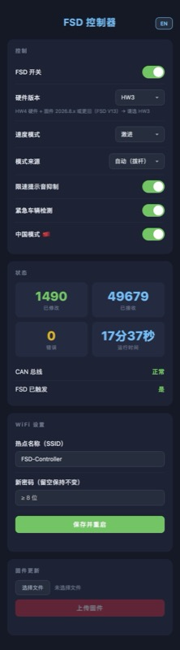
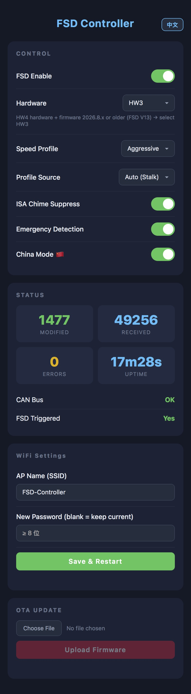
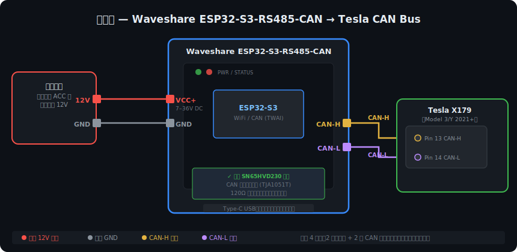

# Tesla FSD Controller — ESP32 Web Edition

<p align="right">English | <a href="README.md">中文</a></p>

> ## 🚫 Notice: This project no longer works on China-region vehicles
>
> Since approximately **March 31, 2026 at 9 PM**, Tesla remotely pushed a low-level configuration to China-region vehicles that disables FSD-related functionality at the chip level. **CAN bus modifications can no longer bypass this restriction — this project no longer works on China-region vehicles.**
>
> Note: Your **FSD account authorization is not affected**. Any purchased or subscribed FSD entitlement remains valid; only this mod is ineffective.
>
> Vehicles outside China are currently unaffected. The codebase is preserved for educational, research, and international use.

---

ESP32 + WiFi web panel build based on [tesla-open-can-mod](https://gitlab.com/Tesla-OPEN-CAN-MOD/tesla-open-can-mod).

After flashing, the ESP32 creates a WiFi hotspot. Connect with your phone and control all parameters in real time from a browser — **no reprogramming required**.

---

## vs. Commercial Closed-Source Modules

Closed-source FSD activation modules sell for around ¥500. Here's the full comparison:

### Feature Comparison

| Feature | Commercial Module | This Project |
|---------|------------------|--------------|
| FSD activation (HW3 / HW4 / Legacy) | ✅ | ✅ |
| Speed offset | ✅ | ✅ |
| Driving mode adjustment | ✅ | ✅ |
| Scroll wheel speed control | ✅ | ✅ |
| China mode toggle | ✅ | ✅ |
| Web control panel | ❌ | ✅ |
| OTA firmware update | ❌ | ✅ |
| Open source / auditable | ❌ | ✅ |
| Affected by 2026.2.9 ban | Same | Same |

### Other Differences

| | Commercial Module | This Project |
|--|--|--|
| **Cost** | ¥500 | ¥30–99 (hardware only) |
| **Source code** | Closed black box, unverifiable | Fully open source, GPL |
| **Runtime configuration** | Usually requires reflashing | Web panel, persists across reboots |
| **Per-vehicle lock** | Yes (repurchase if you change cars) | No, universal firmware |
| **Chip** | Proprietary, opaque | Standard ESP32, public specs |
| **Installation** | Plug and play | Self-wiring + flashing required |

> This project is free and fully open. If you're willing to do it yourself, total hardware cost is under ¥100.

---

## ⚡ Quick Flash (Recommended — no software install needed)

> Uses a pre-built binary. Done entirely in the browser in under 5 minutes.

### Step 1: Download the firmware for your board

> Two firmware files are provided per board — use the right one for the right purpose:
> - **`firmware_xxx.bin`** (merged binary) → first-time flash via ESP Web Flasher at address `0x0`
> - **`firmware_xxx_ota.bin`** (OTA binary) → wireless updates via the web panel "OTA Update" card

| Board | First-time flash | OTA update | Power |
|-------|----------|----------|-------|
| Standard ESP32 dev board + SN65HVD230 | [firmware_esp32.bin](https://github.com/wjsall/tesla-fsd-controller/releases/latest/download/firmware_esp32.bin) | [firmware_esp32_ota.bin](https://github.com/wjsall/tesla-fsd-controller/releases/latest/download/firmware_esp32_ota.bin) | 5V USB |
| **Waveshare ESP32-S3-RS485-CAN** | [firmware_esp32s3_waveshare.bin](https://github.com/wjsall/tesla-fsd-controller/releases/latest/download/firmware_esp32s3_waveshare.bin) | [firmware_esp32s3_waveshare_ota.bin](https://github.com/wjsall/tesla-fsd-controller/releases/latest/download/firmware_esp32s3_waveshare_ota.bin) | **7–36V direct** or **USB-C** |

### Step 2: Flash the firmware

1. Open [ESP Web Flasher](https://esp.huhn.me/) in **Chrome or Edge**
2. Connect the board via **Type-C** → click **Connect** and select the serial port
3. Click **Add File**, select the downloaded firmware, set address to `0x0`
4. Click **Program** and wait for completion
5. Connect to the `FSD-Controller` WiFi hotspot (password: `12345678`), then open `192.168.4.1`

> ⚠️ Safari does not support WebUSB. Use Chrome or Edge.
>
> **Waveshare ESP32-S3 — entering flash mode:** Hold the **BOOT** button, press and release **RST**, then release BOOT. Click Connect and select the port from the popup. The board will reboot automatically after flashing.

<p align="center">
  
  &nbsp;&nbsp;
  
</p>

---

## ⚠️ Important Disclaimer (Read before use)

1. **FSD purchase required** — This device only unlocks a CAN-level restriction. A valid FSD authorization on your Tesla account is required; without it the device has no effect.
2. **Use at your own risk** — The CAN bus connects directly to critical vehicle systems. Incorrect frames could cause unexpected behavior or damage to electronic components. This project is for educational and testing purposes only. The author accepts no liability for vehicle damage, personal injury, or any other loss resulting from use.
3. **Warranty void** — Modifying your vehicle's CAN bus may void the Tesla factory warranty. The user bears all associated risks.
4. **Comply with local laws** — Use of driver-assistance features on public roads must comply with local traffic regulations. Some features may be legally restricted in certain regions.
5. **Accident liability** — Any traffic accidents occurring while using this device — including collisions, property damage, or personal injury — are the sole responsibility of the driver. The author and contributors accept no liability. Always remain attentive, keep hands on the wheel, and be ready to take control at any time.
6. **Test privately first** — On first use, test in a private location to confirm correct operation before driving on public roads.

---

## Hardware Required

### Option A: Standard ESP32 Dev Board (entry-level)

| Component | Notes | Approx. Cost |
|-----------|-------|--------------|
| ESP32 Dev Board | Search "ESP32-DevKitC" or "ESP32 38-pin dev board" | $3–6 |
| SN65HVD230 Module | CAN transceiver — **must be the 3.3V version** | $1–3 |
| Dupont wires (F-F) | Female-to-female, 20 cm, get a pack | $1 |
| USB cable | Micro-USB or Type-C depending on your ESP32 model, for flashing | Usually on hand |

> **Why ESP32?** Built-in WiFi and native CAN (TWAI) controller — no extra chips needed, lowest cost.

### Option B: Waveshare ESP32-S3-RS485-CAN (recommended for permanent in-car install)

| Component | Notes | Approx. Cost |
|-----------|-------|--------------|
| **Waveshare ESP32-S3-RS485-CAN** | [Taobao link](https://m.tb.cn/h.ikuhpPd) — integrated CAN transceiver, DIN rail enclosure, 7–36V wide-voltage input | ~$14 |
| Type-C USB cable | For flashing or USB-C in-car power | Usually on hand |

> **Why this board?** Two power options: **connect directly to car 12V** (7–36V wide-voltage terminal, no buck converter needed) or **power via USB-C**. CAN transceiver built-in (TJA1051T), screw terminal connections (no Dupont wires), DIN rail enclosure for hidden in-car mounting. 120Ω termination resistor is NC by default — no action needed.

---

## Wiring

> 🚫 **Do NOT use the OBD2 port.** The OBD2 diagnostic port connects to a separate diagnostic CAN bus that is isolated by the vehicle's gateway ECU. Modified frames will **never reach the Autopilot computer**. You must connect directly to the internal CAN bus via the X179 or X652 connector.
>
> ⚠️ **The connector locations below are verified for Model 3 / Model Y only.** Model S, Model X, Model 3 Highland, Model Y Juniper, Cybertruck, and other variants use different connectors — do not assume they are the same. Always consult the official Tesla service manual for your vehicle.
>
> - **Model 3 / Model Y (2021 and later):** <a href="https://service.tesla.com/docs/Model3/ElectricalReference/prog-233/connector/x179/" target="_blank" rel="noopener">X179 connector</a> — Pin 13 (CAN-H) / Pin 14 (CAN-L)
> - **Model 3 (2020 and earlier):** <a href="https://service.tesla.com/docs/Model3/ElectricalReference/prog-187/connector/x652/" target="_blank" rel="noopener">X652 connector</a> — Pin 1 (CAN-H) / Pin 2 (CAN-L)
>
> When in doubt, consult the Tesla service manual before touching any wiring.

---

### Option A: Standard ESP32 + SN65HVD230

**Model 3 / Model Y 2021 and later (X179):**


**Model 3 2020 and earlier (X652):**


#### ESP32 ↔ SN65HVD230

```
ESP32 GPIO 5  →  SN65HVD230 TX  (may be labeled CTX or D)
ESP32 GPIO 4  →  SN65HVD230 RX  (may be labeled CRX or R)
ESP32 3.3V    →  SN65HVD230 VCC
ESP32 GND     →  SN65HVD230 GND
```

#### SN65HVD230 ↔ Vehicle CAN Bus

```
SN65HVD230 CANH  →  Vehicle CAN-H  (typically white/brown wire)
SN65HVD230 CANL  →  Vehicle CAN-L  (typically blue/green wire)
```

---

### Option B: Waveshare ESP32-S3-RS485-CAN (recommended for permanent in-car install)



Only 4 wires, all screw-terminal connections:

```
Car 12V (fuse box ACC circuit)  →  Board left terminal VCC+
Car GND                         →  Board left terminal GND
Vehicle CAN-H (X179 Pin 13)    →  Board right terminal CAN H
Vehicle CAN-L (X179 Pin 14)    →  Board right terminal CAN L
```

> - **No** SN65HVD230 module needed — CAN transceiver is integrated (TJA1051T)
> - **No** termination resistor action needed — 120Ω is NC by default
> - **No** USB power in car — connect directly to vehicle 12V ACC (cuts off with ignition)

---

## Step 1: Install Software


### 1.1 Install VS Code

1. Go to [https://code.visualstudio.com](https://code.visualstudio.com), download and install.
2. Open VS Code after installation.

### 1.2 Install the PlatformIO Extension

1. Click the **Extensions** icon in the left sidebar (four squares).
2. Search for `PlatformIO IDE` and click **Install**.
3. After installation a house icon appears in the bottom status bar (you may need to restart VS Code).

> **Slow install?** PlatformIO downloads the ESP32 toolchain on first launch (~200–500 MB). Keep your network connection stable and wait.

---

## Step 2: Download and Open the Project

1. Click the green **Code** button at the top of this page and select **Download ZIP**.
2. Extract to any folder, e.g. `C:\tesla-fsd`.
3. In VS Code, go to **File → Open Folder** and select the extracted folder.
4. If prompted "Do you trust the authors?", click **Yes, I trust the authors**.

---

## Step 3: Configuration

> **No code changes required before flashing.** WiFi name/password and hardware version can both be changed after flashing via the web panel. Settings are saved automatically.

### 3.1 Change WiFi Hotspot Name and Password

**Recommended (change via web panel after flashing):**

1. After flashing, connect to the default hotspot `FSD-Controller` (password `12345678`).
2. Open `192.168.4.1` in your browser. Go to the **WiFi Settings** card, enter a new name and password.
3. Click **Save & Restart**. Reconnect using the new credentials.

**Alternative (edit source before flashing):**

Open `src/main.cpp` and find lines 20–21:

```cpp
static char apSSID[33] = "FSD-Controller";
static char apPass[64] = "12345678";
```

Change the quoted values to your preferred name and password (minimum 8 characters).

### 3.2 Know Your Hardware Version

**No code changes needed.** After flashing, select the hardware version from the **Hardware** dropdown in the web panel. The setting is saved to flash and persists across reboots.

Identify your version before connecting so you can select it immediately:

| Display in car | Firmware version | FSD version | Panel selection |
|----------------|-----------------|-------------|-----------------|
| HW4.x | 2026.2.9.x or newer | V14 | `HW4` |
| HW4.x | 2026.8.x or older | V13 | `HW3` ⚠️ |
| HW3.x | Any | V13 | `HW3` |
| Legacy Model S/X (portrait screen) | Any | — | `LEGACY` |

> ⚠️ **HW4 hardware + V13 firmware must use `HW3` mode.** HW4 mode is designed for FSD V14 and causes intermittent behavior on V13 firmware. Check your firmware version under **Controls → Software** in the car.

---

## Step 4: Flash Firmware

### Connect the ESP32

Connect the ESP32 to your computer with a USB cable.

### Flash via VS Code

1. Click **✓ Build** in the bottom status bar to compile and confirm no errors.
2. Click **→ Upload** to flash.
3. The terminal will show `success` when complete.

> **Upload failed?**
> - Check that your USB cable supports data transfer (charge-only cables won't work).
> - Click the port selector in the status bar and confirm the correct COM port is selected.
> - Some ESP32 boards require holding the **BOOT** button until the upload progress bar appears.

---

## Step 5: Using the Control Panel

### 5.1 Connect to WiFi

1. Power the ESP32 (USB power bank or any USB power source).
2. On your phone, find `FSD-Controller` (or your custom name) in WiFi settings and connect.
3. Open `192.168.4.1` in your phone's browser.

### 5.2 Control Panel Reference

| Setting | Description |
|---------|-------------|
| **FSD Enable** | Master switch — when off, no CAN frames are modified |
| **Hardware** | Match to your vehicle hardware (can be changed at runtime) |
| **Speed Profile** | Controls how aggressively FSD drives — see table below |
| **Profile Source** | Auto (Stalk) = follow-distance stalk controls the profile; Manual = fixed to the dropdown selection |
| **ISA Chime Suppress** | Suppresses ISA speed-limit chime (HW4 only) |
| **Emergency Detection** | Enables emergency vehicle detection (HW4 FSD V14 only) |
| **China Mode 🇨🇳** | Required for regions where "Traffic Light and Stop Sign Control" is not available in the car UI (China, Japan, etc.). Without this, the trigger condition is never met and the device has no effect. |
| **WiFi Settings** | Change the hotspot SSID and password. Click Save & Restart — the device reboots with the new credentials. |

### 5.3 Speed Profile Reference

| Profile | HW3 display | HW4 display |
|---------|-------------|-------------|
| Chill | ❄️ Chill | ❄️ Chill |
| Default | 🟢 Normal | 🟢 Normal |
| Moderate | ⚡ Hurry | ⚡ Hurry |
| Aggressive | — | 🔥 Max (fastest) |
| Maximum | — | 🐢 Sloth (slowest) |

> Follow-distance stalk: lower number = more aggressive; higher number = more conservative.

### 5.4 Status Monitor

The status card updates in real time:
- **Modified** — CAN frames modified since boot (> 0 means the device is working)
- **Received** — total CAN frames received
- **Errors** — CAN bus error count (should be 0)
- **Uptime** — time since last boot
- **CAN Bus** — OK means successfully connected to the vehicle CAN bus
- **FSD Triggered** — Yes means FSD has been activated

---

## Step 6: OTA Firmware Update

After modifying and rebuilding the firmware, you can update wirelessly — no USB needed:

1. Build in VS Code (click **Build**).
2. The build script auto-generates **`firmware_esp32_ota.bin`** (or `firmware_esp32s3_waveshare_ota.bin` for Waveshare) in the project root.
3. In the web panel, find the **OTA Update** card, click **Choose File**, select the **`_ota.bin`** file.
4. Click **Upload Firmware** and wait for the progress bar. The device restarts automatically.

> ⚠️ **OTA requires the `_ota.bin` file.** Do not upload the merged `firmware_esp32.bin` — it contains the bootloader and will fail with "Wrong Magic Byte".

---

## FAQ

**Q: Browser can't open 192.168.4.1 after connecting to WiFi?**
> Some phones automatically disconnect from WiFi networks with no internet. In your phone's WiFi settings, find the hotspot and disable "Auto-switch to better network" or "Smart WiFi".

**Q: CAN Bus shows ERROR?**
> Check that CANH/CANL wiring is correct and that the vehicle is powered on (at least in standby). The CAN bus only carries signals when the vehicle is on.

**Q: FSD Triggered shows No?**
> Confirm that "Traffic Light and Stop Sign Control" is enabled under **Controls → Autopilot** in the car. This is the trigger condition.

**Q: Do I need to remove the 120Ω termination resistor from the CAN module?**
> Tesla's CAN bus already has built-in termination at both ends. Adding another 120Ω resistor will degrade signal quality and cause communication failures — **make sure the module's 120Ω resistor is disconnected**.
> - **SN65HVD230 module**: The chip itself has no termination resistor, but some manufacturers add one to the PCB, controlled by a jumper or solder bridge. Check the back of your module for a **120R** marking — if the jumper is connected or the solder bridge is closed, disconnect it (remove the jumper cap or cut the solder bridge with a blade).
> - **MCP2515 blue module**: **Must remove** the R1/R2 resistors or cut the J1 jumper.

**Q: Modified count stays at 0, device has no effect? (China, Japan, etc.)**
> Enable **China Mode 🇨🇳** in the control panel. In these regions the car UI hides the "Traffic Light and Stop Sign Control" option due to a regional restriction, so the trigger bit (`UI_fsdStopsControlEnabled`) is always 0 and the mod never fires. China Mode bypasses this check.

**Q: Device appears to work but FSD still doesn't activate?**
> Check that your Tesla account has a valid FSD authorization (purchased or subscribed). The device operates at the CAN level only and cannot bypass Tesla's server-side authorization.

**Q: Speed profile setting has no effect?**
> Make sure **Profile Source** is set to **Manual**. If set to Auto (Stalk), the stalk position overrides the dropdown.

**Q: Flash error "A fatal error occurred: Failed to connect to ESP32"?**
> Hold the **BOOT** button on the dev board while flashing. Release it once the upload progress bar appears.

---

## Project Structure (for developers)

```
src/
  main.cpp              ← Entry point: WiFi AP + web server + CAN task (dual-core)
include/
  handlers.h            ← CAN frame processing (Legacy / HW3 / HW4)
  can_helpers.h         ← Bit manipulation helpers
  can_frame_types.h     ← CAN frame data structures
  web_ui.h              ← Embedded web UI (HTML/CSS/JS)
  drivers/
    can_driver.h        ← Driver abstraction base class
    twai_driver.h       ← ESP32 TWAI driver
platformio.ini          ← Build config (ESP32 + ESPAsyncWebServer)
```

---

## Credits

This project is built on top of the following open-source work. The core CAN frame handling logic is derived directly from the original project:

| Project | Link | License |
|---------|------|---------|
| tesla-open-can-mod | [gitlab.com/Tesla-OPEN-CAN-MOD/tesla-open-can-mod](https://gitlab.com/Tesla-OPEN-CAN-MOD/tesla-open-can-mod) | GPLv3 |

---

## License

GPLv3 — derived from [tesla-open-can-mod](https://gitlab.com/Tesla-OPEN-CAN-MOD/tesla-open-can-mod) (GPLv3).
